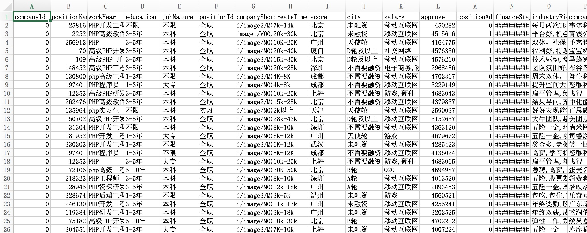

## Employment-Analysis

基于 Laravel5 的互联网职业数据分析工具

### 职位抓取

```markdown
# 测试抓取职位，并在控制台输出第一页
php artisan command:capture
```


```markdown
# 抓取关键字职位，并保存 csv 文件
php artisan command:csv-position --keyword PHP
```




## License

The `PrettyJob` is open-sourced software licensed under the [MIT license](https://opensource.org/licenses/MIT).
