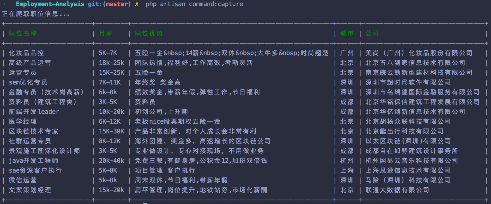

## Employment-Analysis

基于 Laravel5 的互联网职业数据分析工具

### 职位抓取

```markdown
php artisan command:capture
```




## License

The `PrettyJob` is open-sourced software licensed under the [MIT license](https://opensource.org/licenses/MIT).
